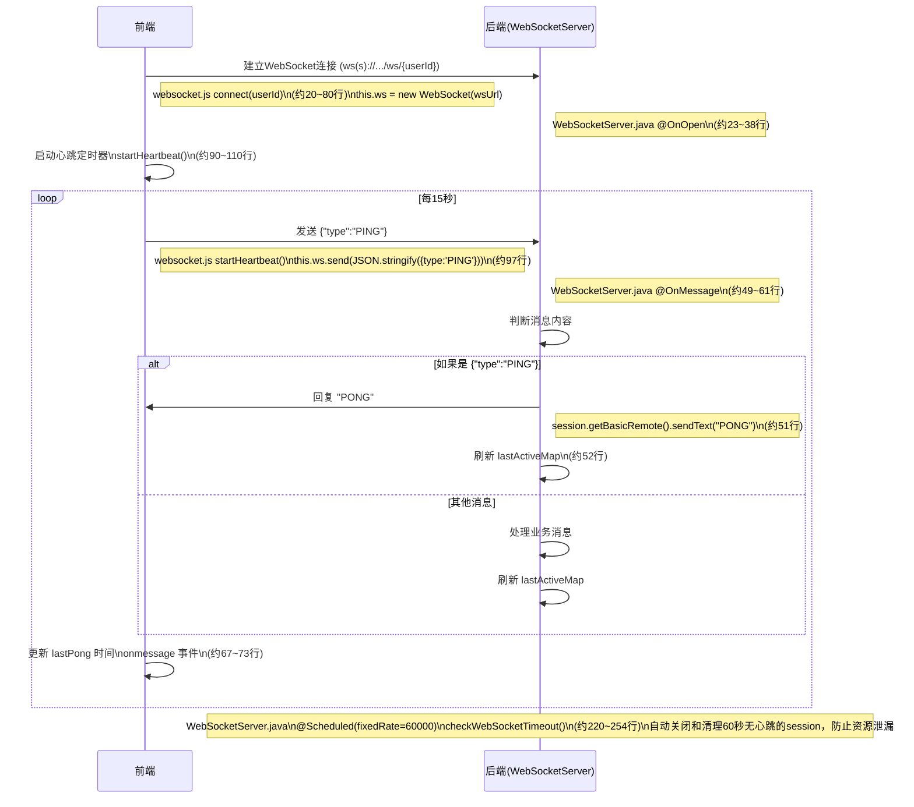

# WebSocket 前后端通讯流程（含源码文件与行号）

## 1. 连接建立

- **前端**
  - `school-homework-ui/src/utils/websocket.js`
    - `WebSocketService.connect(userId)` 方法，约第 20~80 行
    - 关键代码：`this.ws = new WebSocket(wsUrl);`
- **后端**
  - `lesson-server/src/main/java/com/lesson/websocket/WebSocketServer.java`
    - `@OnOpen` 注解的方法，约第 23~38 行

---

## 2. 前端启动心跳定时器

- **前端**
  - `school-homework-ui/src/utils/websocket.js`
    - `WebSocketService.startHeartbeat()` 方法，约第 90~110 行
    - 关键代码：`this.heartbeatTimer = setInterval(() => { ... }, this.heartbeatInterval);`

---

## 3. 前端定时发送心跳包

- **前端**
  - `school-homework-ui/src/utils/websocket.js`
    - `startHeartbeat()` 方法内部
    - 关键代码：`this.ws.send(JSON.stringify({ type: 'PING' }));`（约第 97 行）

---

## 4. 后端收到心跳包并响应

- **后端**
  - `lesson-server/src/main/java/com/lesson/websocket/WebSocketServer.java`
    - `@OnMessage` 注解的方法，约第 49~61 行
    - 关键代码：
      ```java
      if ("{\"type\":\"PING\"}".equals(message)) {
          session.getBasicRemote().sendText("PONG");
          lastActiveMap.put(session, System.currentTimeMillis());
          return;
      }
      ```

---

## 5. 前端收到 PONG 并刷新时间

- **前端**
  - `school-homework-ui/src/utils/websocket.js`
    - `this.ws.onmessage = (event) => { ... }`，约第 67~73 行
    - 关键代码：
      ```js
      if (event.data === 'PONG') {
        this.lastPong = Date.now();
        return;
      }
      ```

---

## 6. 后端定时检查超时连接并自动清理无用 session

- **后端**
  - `lesson-server/src/main/java/com/lesson/websocket/WebSocketServer.java`
    - `@Scheduled(fixedRate = 60000) public void checkWebSocketTimeout()`，约第 220~254 行
    - 关键代码：
      ```java
      // 找出超时的session
      if (now - entry.getValue() > 60000) { // 60秒无心跳
          timeoutSessions.add(entry.getKey());
      }
      // 清理超时的session
      session.close();
      lastActiveMap.remove(session);
      ```
    - 说明：后端每分钟自动检查所有 session，若 60 秒未收到心跳或消息，则主动关闭并清理无用 session，防止资源泄漏。

---

## Mermaid 时序图（带文件和行号注释）

