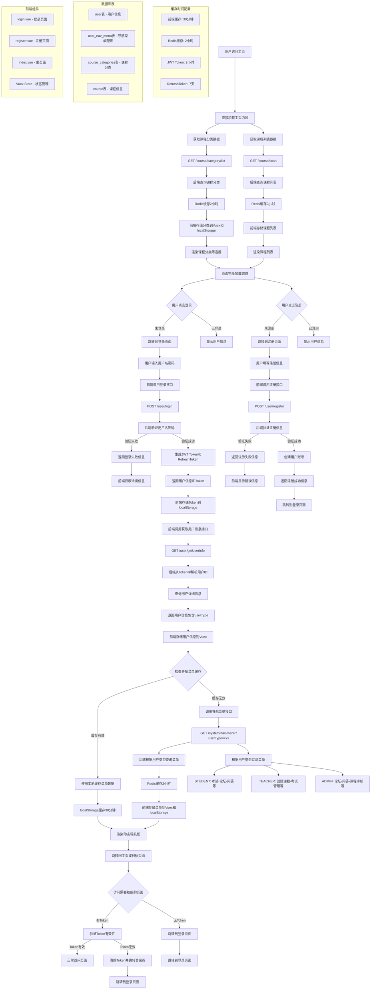

# 在线教育系统流程图

## 前端登录到加载分类与动态导航栏的完整流程

## 流程说明

### 1. 登录阶段
- **接口**: `POST /user/login`
- **功能**: 验证用户名密码，生成JWT Token
- **返回**: 用户信息、accessToken、refreshToken

### 2. 用户信息获取
- **接口**: `GET /user/getUserInfo`
- **功能**: 根据Token获取用户详细信息
- **关键**: 获取userType用于权限控制

### 3. 动态导航菜单
- **接口**: `GET /system/nav-menu?userType=xxx`
- **功能**: 根据用户类型返回对应的导航菜单
- **缓存**: 30分钟本地缓存 + 2小时Redis缓存

### 4. 课程分类加载
- **接口**: `GET /course/category/list`
- **功能**: 获取所有课程分类用于筛选
- **缓存**: 30分钟本地缓存 + 2小时Redis缓存

### 5. 权限控制机制
- **学生(STUDENT)**: 考试、论坛、问答、收藏、我的课程、购物车
- **教师(TEACHER)**: 创建课程、考试管理、论坛、问答
- **管理员(ADMIN)**: 论坛、问答、课程审核

### 6. 缓存策略
- **前端**: localStorage缓存30分钟
- **后端**: Redis缓存2小时
- **Token刷新**: 自动刷新机制，401时使用refreshToken

## 技术架构要点

### 缓存机制
1. **前端优先**: 先检查localStorage缓存，30分钟内直接使用
2. **后端兜底**: 前端缓存过期后，调用后端接口，后端Redis缓存2小时
3. **降级机制**: Redis不可用时，自动降级到数据库查询
4. **强制刷新**: 登录时强制刷新菜单，确保数据最新

### 权限控制
- 基于用户类型的动态菜单加载
- JWT Token验证用户身份
- 前端路由守卫控制页面访问权限

### 错误处理
- 登录失败显示具体错误信息
- Token失效自动跳转登录页
- 网络异常降级处理 