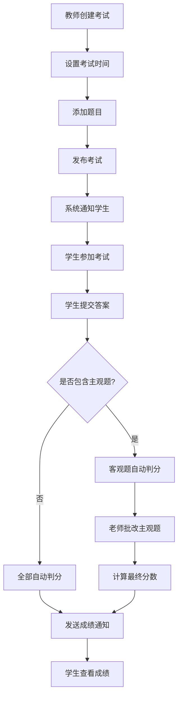

# 在线教育系统使用手册

## 目录
- [系统概述](#系统概述)
- [教师端使用指南](#教师端使用指南)
- [学生端使用指南](#学生端使用指南)
- [课程内容管理](#课程内容管理)
- [学习进度跟踪](#学习进度跟踪)
- [考试系统使用](#考试系统使用)
- [常见问题解答](#常见问题解答)

## 系统概述

本系统是一个完整的在线教育平台，支持教师创建课程、上传教学资源，学生购买学习、跟踪进度，以及完整的考试管理功能。

### 主要功能
- **教师端**：创建课程、上传文档/视频、管理章节、发布考试、批改试卷
- **学生端**：浏览课程、购买学习、查看进度、参加考试、查看成绩
- **系统端**：内容解析、进度跟踪、自动判分、权限控制

## 教师端使用指南

### 1. 课程创建与管理

#### 1.1 创建课程
**适用场景**：教师需要创建新的在线课程

**操作步骤**：
1. 登录教师账号，进入"课程管理"页面
2. 点击"创建课程"按钮
3. 填写课程基本信息：
   - 课程名称（必填，最多100字符）
   - 课程简介（必填，最多200字符）
   - 选择课程分类
   - 设置价格和原价
   - 上传封面图片（JPG/PNG格式，最大2MB）
   - 添加课程标签（用逗号分隔）
4. 点击"提交"完成创建

**注意事项**：
- 封面图片必须是JPG或PNG格式，大小不超过2MB
- 课程创建后需要等待管理员审核

#### 1.2 课程审核状态
| 状态 | 说明 | 可执行操作 |
|------|------|------------|
| 待审核 | 等待管理员审核  |
| 已通过 | 审核通过，可正常使用  |
| 已拒绝 | 审核被拒绝 | 查看拒绝原因、重新编辑 |

### 2. 章节内容管理

#### 2.1 添加章节
**操作步骤**：
1. 在课程管理页面，点击"章节管理"
2. 点击"添加章节"按钮
3. 填写章节信息：
   - 章节名称（必填）
   - 选择内容类型：视频或文档
   - 设置是否免费
4. 上传内容文件
5. 点击"保存"完成添加

#### 2.2 内容类型说明

**视频章节**：
- 支持格式：MP4、AVI、MOV、WMV、FLV、MKV、WEBM
- 文件大小：无限制（建议不超过2GB以确保流畅播放）
- 系统自动获取视频时长
- 支持在线播放和进度记录

**文档章节**：
- 支持格式：PDF、DOC、DOCX、TXT、MD、XLS、XLSX
- 文件大小限制：最大100MB
- 系统自动解析文档内容，支持分页阅读

#### 2.3 文档解析功能

**支持的文档格式**：
- **PDF文件**：使用PDFBox解析，提取文本内容
- **Word文档**：支持DOC和DOCX格式，解析段落和表格
- **文本文件**：TXT和MD格式，支持Markdown渲染
- **Excel文件**：支持XLS和XLSX格式，解析单元格内容

**解析失败处理**：
- 如果文档解析失败，系统仍会保存原始文件
- 学生可以下载原始文件查看
- 系统显示"文档解析失败，请下载原始文件查看"提示
- 提供5分钟有效的临时下载链接

**图片识别说明**：
- 系统目前不支持图片中的文字识别（OCR）
- 仅支持文本内容的解析

#### 2.4 章节权限设置
- **免费章节**：所有用户都可以访问
- **付费章节**：只有购买课程的学生与管理员才能访问
- **教师权限**：课程创建者可以访问自己课程的所有内容

### 3. 考试管理

#### 3.1 创建考试
**操作步骤**：
1. 进入"考试管理"页面
2. 点击"创建考试"按钮
3. 填写考试信息：
   - 考试名称
   - 选择所属课程
   - 设置考试时间（开始和结束时间）
4. 添加考试题目：
   - 单选题：A、B、C、D选项
   - 多选题：A,B,C格式（逗号分隔）
   - 判断题：true/false
   - 简答题：自由文本（需手动批改）
5. 设置每题分值
6. 点击"创建考试"完成

#### 3.2 发布考试
**推送条件**：
- 考试状态为"未开始"
- 学生已购买该课程且订单状态为"已支付"
- 学生尚未提交该考试

**通知方式**：
- 系统内通知消息
- WebSocket实时推送
- 自动跳转到考试列表页面

#### 3.3 试卷批改
**需要批改的情况**：
- 考试包含简答题（主观题）
- 学生已提交考试
- 客观题已自动判分完成

**批改流程**：
1. 进入"批改试卷"页面
2. 选择要批改的考试
3. 查看学生答案和参考答案
4. 为每道简答题打分
5. 提交批改结果

**分数计算**：
- 最终分数 = 客观题自动得分 + 主观题老师批改得分

## 学生端使用指南

### 1. 课程学习

#### 1.1 浏览和购买课程
**操作步骤**：
1. 在课程列表页面浏览可用课程
2. 点击课程查看详细信息
3. 查看章节列表和免费/付费标识
4. 点击"立即购买"或"加入购物车"
5. 完成支付后即可访问所有内容

#### 1.2 学习内容访问

**免费章节**：
- 无需购买即可访问
- 支持在线观看视频或阅读文档
- 记录学习进度

**付费章节**：
- 需要先购买课程
- 购买后可以访问所有章节内容
- 支持在线学习和下载

**访问权限控制**：
| 用户类型 | 免费章节 | 付费章节 | 说明 |
|---------|---------|---------|------|
| 管理员 | ✅ | ✅ | 可访问所有内容 |
| 课程教师 | ✅ | ✅ | 可访问自己课程的所有内容 |
| 已购学生 | ✅ | ✅ | 可访问已购买课程的所有内容 |
| 未购学生 | ✅ | ❌ | 只能访问免费章节 |
| 游客 | ❌ | ❌ | 需要登录后才能访问 |（ :tw-1f493: 这里的游客是可以浏览课程列表封面的，只是不能点进去查看详情）

### 2. 学习进度跟踪

#### 2.1 进度记录机制
**视频学习**：
- 观看完整视频后自动标记为完成
- 系统记录观看时长和最后观看时间

**文档学习**：
- 阅读到最后一页后自动标记为完成
- 下载文档后也会标记为完成
- 支持分页阅读和进度保存

**进度计算**：
- 进度百分比 = 已完成章节数 / 总章节数 × 100%
- 学习时长：每个完成章节默认记录30分钟（ :tw-1f493: 这里不是三十分钟了，是累加这个章节的视频实际时长，假如说一个十分钟的课，这个人看了两遍，那累加的是10不是20，然后如果章节是文档的话，就是默认按十分钟算）

#### 2.2 查看学习进度
**我的课程页面**：
- 显示所有购买的课程
- 每个课程显示学习进度百分比
- 显示已完成章节数和总章节数
- 显示学习时长和最后学习时间（ :tw-1f493: 这个最后时间没有在前端展示）

**学习统计**：
- 总课程数
- 已完成课程数
- 总学习时长
- 总章节数

### 3. 考试参与

#### 3.1 查看考试
**显示条件**：
- 已购买相关课程
- 课程订单状态为"已支付"
- 教师已发布考试

**考试状态**：
- **未开始**：显示考试信息，无法进入
- **进行中**：可以参加考试
- **已结束**：显示考试信息，无法参加

#### 3.2 参加考试
**操作步骤**：
1. 在考试列表中找到要参加的考试
2. 点击"参加考试"
3. 仔细阅读题目，填写答案
4. 提交考试

**注意事项**：
- 必须在考试时间范围内提交
- 提交后无法修改答案
- 每人只能提交一次

#### 3.3 查看成绩
**客观题**：
- 提交后立即显示得分
- 显示正确答案和解析

**主观题（简答题）**：
- 需要等待老师批改
- 批改完成后显示得分

## 课程内容管理

### 1. 文档上传规范

#### 1.1 支持的文件格式
**文档类型**：
- PDF文件（.pdf）
- Word文档（.doc, .docx）
- 文本文件（.txt）
- Markdown文件（.md）
- Excel文件（.xls, .xlsx）

**图片类型**：
- JPG格式（.jpg, .jpeg）
- PNG格式（.png）

**视频类型**：
- MP4、AVI、MOV、WMV、FLV、MKV、WEBM

#### 1.2 文件大小限制
- 文档文件：最大100MB
- 图片文件：最大2MB
- 视频文件：无限制（建议不超过2GB以确保流畅播放）

#### 1.3 文档解析说明
**解析成功**：
- 系统自动提取文档文本内容
- 支持分页显示
- 支持Markdown渲染
- 学生可以在线阅读

**解析失败**：
- 系统保存原始文件
- 提供下载链接供学生下载查看
- 显示"文档解析失败，请下载原始文件查看"提示
- 下载链接5分钟内有效

### 2. 内容权限管理

#### 2.1 章节权限设置
**免费章节**：
- 所有登录用户都可以访问
- 无需购买课程
- 适合课程预览和推广

**付费章节**：
- 只有购买课程的学生才能访问
- 支持在线学习和下载
- 记录学习进度

#### 2.2 访问控制机制
**前端控制**：
- 根据用户类型和购买状态显示/隐藏操作按钮
- 未购买时显示购买提示

**后端验证**：
- 每次访问内容时进行权限校验
- 无权限时返回403错误
- 提供友好的错误提示

## 学习进度跟踪

### 1. 进度记录方式

#### 1.1 数据库结构
```sql
CREATE TABLE learning_progress (
    progress_id INT PRIMARY KEY AUTO_INCREMENT,
    user_id INT,           -- 用户ID
    course_id INT,         -- 课程ID  
    chapter_id INT,        -- 章节ID
    status INT,            -- 状态：0-未完成，1-已完成
    last_watch_time TIMESTAMP -- 最后观看时间
);
```

#### 1.2 进度计算规则
**完成条件**：
- 视频：观看完整视频
- 文档：阅读到最后一页或下载文档
- 系统自动标记为完成状态

**进度百分比**：
- 计算公式：已完成章节数 / 总章节数 × 100%
- 实时更新显示（ :tw-1f493: 这里的实时不是websocket推送，是打开这个页面发一次请求，得到更新数据之后展示在前端）

### 2. 学习统计功能

#### 2.1 个人统计
- 总课程数
- 已完成课程数
- 总学习时长（分钟）
- 总章节数

#### 2.2 课程统计
- 学习进度百分比
- 已完成章节数/总章节数
- 学习时长
- 最后学习时间
- 课程状态（学习中/已完成）

## 考试系统使用

### 1. 考试流程详解（ :tw-1f493: 老师创建了考试，就推送给符合条件的学生，学生交完卷，如果考试没有主观题，那就系统直接出分，加离线通知。如果有主观题，那学生交完卷就会提醒老师，老师改完再推给学生）
这个 WebSocket 是前端用 userId 给后端发起连接，连接成功后端会把这个 session 保存下来。由于 WebSocket 服务器设置了 60 秒内必须有一次通讯，否则会自动断开，所以前端会每隔 15 秒主动向后端发送一次心跳包（{"type":"PING"}），后端收到后回复 "PONG" 并刷新活跃时间。后端每分钟会定时检查所有 session，如果 60 秒内没有收到心跳或消息，就会主动关闭并清理无用 session，防止资源泄漏。这样可以保证只有在线的用户 session 会被保留，离线用户会被及时清理）


### 2. 支持的题型

#### 2.1 单选题（SINGLE_CHOICE）
- 格式：A、B、C、D选项
- 判分：答案完全匹配
- 自动判分

#### 2.2 多选题（MULTIPLE_CHOICE）
- 格式：A,B,C（逗号分隔）
- 判分：答案顺序无关，内容匹配
- 自动判分

#### 2.3 判断题（JUDGE）
- 格式：true/false
- 判分：大小写不敏感
- 自动判分

#### 2.4 简答题（TEXT）
- 格式：自由文本
- 判分：需要老师手动批改
- 支持自定义分值

### 3. 考试统计功能

#### 3.1 统计指标
- 参加人数
- 平均分
- 最高分/最低分
- 及格率
- 正确率（仅客观题）

#### 3.2 统计规则
- **分数计算**：优先使用最终分数（批改后），否则使用自动分数
- **正确率**：只统计客观题，不包括简答题
- **及格线**：总分的60%

## 常见问题解答

### 教师常见问题

**Q: 文档上传失败怎么办？**
A: 检查文件格式是否支持，文件大小是否超限（文档最大100MB）。如果解析失败，学生仍可下载原始文件查看。

**Q: 视频文件有大小限制吗？**
A: 视频文件无大小限制，但建议不超过2GB以确保流畅播放。

**Q: 如何设置章节为免费？**
A: 在添加章节时，将"是否免费"开关打开即可。

**Q: 学生看不到我的课程怎么办？**
A: 检查课程审核状态，确保已通过审核。只有审核通过的课程学生才能看到。

**Q: 什么时候可以推送考试？**
A: 考试状态为"未开始"时，且学生已购买课程。

**Q: 什么情况下需要批改？**
A: 考试包含简答题时，需要老师手动批改主观题。

### 学生常见问题

**Q: 为什么看不到某些章节？**
A: 付费章节需要先购买课程，免费章节可以直接访问。

**Q: 文档解析失败怎么办？**
A: 可以点击下载按钮获取原始文件查看。

**Q: 学习进度不更新怎么办？**
A: 确保完整观看视频或阅读文档到最后一页，系统会自动记录进度。

**Q: 为什么看不到某些考试？**
A: 需要先购买相关课程，且教师已发布考试。

**Q: 可以重复提交考试吗？**
A: 不可以，每人只能提交一次。

### 系统功能说明

**内容解析**：
- 支持PDF、Word、TXT、MD、Excel格式解析
- 不支持图片中的文字识别
- 解析失败时提供原始文件下载

**权限控制**：
- 基于用户类型和购买状态的细粒度权限控制
- 支持免费/付费章节设置
- 实时权限验证

**进度跟踪**：
- 自动记录学习进度
- 支持视频和文档学习进度
- 提供详细的学习统计

**考试系统**：
- 支持四种题型
- 自动判分和手动批改
- 完整的考试流程管理

## 技术说明

### 文件存储
- 使用MinIO对象存储服务（ :tw-1f493: 现在改成阿里云OSS服务端转发上传）
- 支持大文件上传和断点续传
- 提供临时下载链接

### 安全机制
- JWT身份验证
- 基于角色的权限控制
- 文件访问权限验证
- 防重复提交保护

### 数据存储
- **课程信息**：course表
- **章节信息**：course_chapters表
- **学习进度**：learning_progress表
- **考试信息**：exam表
- **学生答卷**：exam_papers表

---

**版本**：v2.0  
**更新时间**：2025年7月  
**维护团队**：在线教育系统开发组 