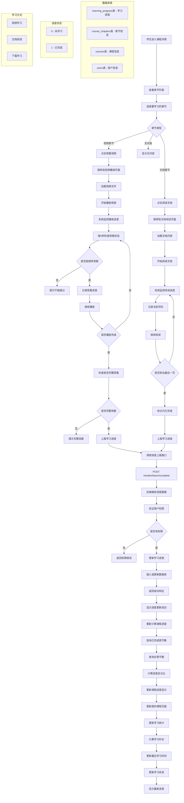

# 学习流程与进度更新流程图

## 从课程学习到进度更新的完整流程



## 流程详解

### 1. 学习入口阶段

**课程详情页面**：
- 显示课程基本信息
- 列出所有章节（视频/文档）
- 显示章节学习状态
- 提供学习入口按钮

**章节类型识别**：
- **视频章节**：显示"观看视频"按钮
- **文档章节**：显示"阅读文档"和"下载文档"按钮
- **无内容章节**：显示"无内容"（禁用状态）

### 2. 视频学习流程

**视频播放监控**：
```javascript
// 每5秒检查观看状态
onTimeUpdate(e) {
  const userType = this.$store?.state?.user?.userType
  if (userType !== 'STUDENT') return
  const idx = Math.floor(e.target.currentTime / this.interval)
  const maxIdx = this.watched.lastIndexOf(true)
  if (idx <= maxIdx + 1) {
    this.$set(this.watched, idx, true)
  }
}
```

**防跳过机制**：
```javascript
onSeeking(e) {
  const idx = Math.floor(e.target.currentTime / this.interval)
  const maxIdx = this.watched.lastIndexOf(true)
  if (idx > maxIdx + 1) {
    this.$confirm('请按顺序观看，不能跳过！', '提示', {
      confirmButtonText: '知道了',
      showCancelButton: false,
      type: 'warning'
    })
  }
}
```

**完成检测**：
```javascript
async onEnded(e) {
  const totalBlocks = Math.ceil(this.duration / this.interval)
  const allWatched = this.watched.length >= totalBlocks && 
                     this.watched.slice(0, totalBlocks).every(Boolean)
  if (allWatched) {
    // 上报学习进度
    await reportChapterProgress({
      courseId: this.courseId,
      chapterId: this.chapterId
    })
  }
}
```

### 3. 文档学习流程

**文档阅读监控**：
- 监控当前页码
- 检测是否到达最后一页
- 自动标记为已完成

**完成条件**：
```javascript
// 到达最后一页时自动完成
watch: {
  currentPage(val) {
    if (val === this.pages.length && this.pages.length > 0) {
      const userType = this.$store?.state?.user?.userType
      if (userType === 'STUDENT') {
        this.finished = true
        this.$emit('finished')
        this.reportDocFinished && this.reportDocFinished()
      }
    }
  }
}
```

### 4. 进度上报流程

**接口调用**：
```javascript
// 上报学习进度
export function reportChapterProgress({ courseId, chapterId }) {
  return request({
    url: '/student/learn/complete',
    method: 'post',
    data: { courseId, chapterId }
  })
}
```

**后端处理**：
```java
@Override
public void completeChapter(Integer userId, Integer courseId, Integer chapterId) {
    learnMapper.upsertProgress(userId, courseId, chapterId, 1);
}
```

**数据库更新**：
```sql
INSERT INTO learning_progress (user_id, course_id, chapter_id, status, last_watch_time)
VALUES (#{userId}, #{courseId}, #{chapterId}, #{status}, NOW())
ON DUPLICATE KEY UPDATE status = #{status}, last_watch_time = NOW()
```

### 5. 进度计算流程

**进度计算公式**：
```java
@Override
public String getLearnProcess(LearnProcessDTO learnProcessDTO) {
    Integer LearnedNum = learnMapper.getLearnedNum(learnProcessDTO);
    Integer ChapterNum = learnMapper.getChapterNum(learnProcessDTO);
    float result = (float) LearnedNum / ChapterNum;
    return String.format("%.2f%%", result * 100);
}
```

**SQL查询**：
```sql
-- 查询已完成章节数
SELECT COUNT(*) FROM learning_progress 
WHERE user_id = #{userId} AND course_id = #{courseId} AND status = 1

-- 查询总章节数
SELECT COUNT(*) FROM course_chapters WHERE course_id = #{courseId}
```

### 6. 学习统计更新

**统计信息**：
- 总课程数
- 已完成课程数
- 总学习时长
- 总章节数

**课程状态**：
```sql
CASE 
    WHEN COALESCE(progress_info.progress, 0) >= 100 THEN 'completed'
    ELSE 'learning'
END as status
```

## 技术要点

### 数据库设计

**learning_progress表**：
- progressId：进度ID（主键）
- userId：用户ID
- courseId：课程ID
- chapterId：章节ID
- status：状态（0-未完成，1-已完成）
- lastWatchTime：最后观看时间

**索引设计**：
```sql
UNIQUE INDEX `uniq_user_course_chapter`(`user_id`, `course_id`, `chapter_id`)
INDEX `user_id`(`user_id`)
INDEX `chapter_id`(`chapter_id`)
```

### 权限控制

**用户类型限制**：
- 只有学生用户才记录学习进度
- 老师和管理员不记录进度

**访问权限**：
- 免费章节：所有登录用户可访问
- 付费章节：只有购买课程的学生可访问

### 进度监控机制

**视频监控**：
- 每5秒检查观看状态
- 防止跳过观看
- 完整观看后自动完成

**文档监控**：
- 监控页码变化
- 到达最后一页自动完成
- 支持下载后标记完成

### 错误处理

**常见错误**：
- 用户未登录
- 课程不存在
- 章节不存在
- 无权限访问

**异常处理**：
```java
try {
    learnMapper.upsertProgress(userId, courseId, chapterId, 1);
} catch (Exception e) {
    log.error("更新学习进度失败", e);
    return Result.error("进度更新失败");
}
```

### 前端交互

**进度显示**：
- 实时显示学习进度百分比
- 显示已完成/总章节数
- 显示学习时长和最后学习时间

**状态反馈**：
- 学习完成时显示成功提示
- 进度更新失败时显示错误提示
- 防跳过时显示警告提示

这个学习流程通过严格的进度监控和防跳过机制，确保了学习质量，同时提供了完善的统计和反馈功能！ 