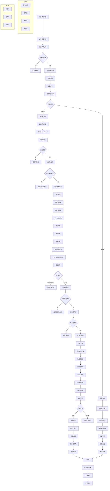

# 用户下单流程图

## 从浏览课程到完成支付的完整流程



## 流程详解

### 1. 浏览课程阶段

**课程展示**：
- 显示课程列表，包含课程名称、价格、封面
- 支持按分类筛选和搜索
- 显示课程审核状态

**课程详情**：
- 课程基本信息（名称、价格、描述）
- 章节列表（免费/付费标识）
- 教师信息
- 学习人数统计

**权限检查**：
- 只有审核通过的课程才能购买
- 未登录用户只能浏览，不能购买

### 2. 购买决策阶段

**两种购买方式**：

1. **加入购物车**：
   - 适合多课程购买
   - 可以批量管理
   - 支持后续修改

2. **直接购买**：
   - 适合单课程购买
   - 快速完成购买
   - 自动添加到购物车并立即支付

### 3. 购物车管理

**添加购物车**：
```java
// 验证条件
- 用户已登录
- 课程存在且已审核通过
- 课程不在购物车中
- 用户类型为学生
```

**购物车操作**：
- 查看购物车列表
- 移除单个课程
- 清空购物车
- 批量结算

### 4. 订单创建流程

**权限验证**：
```java
// 只允许学生下单
if ("TEACHER".equalsIgnoreCase(user.getUserType()) || "ADMIN".equalsIgnoreCase(user.getUserType())) {
    throw new RuntimeException("只有学生可以下单，老师和管理员无法下单");
}
```

**订单验证**：
- 检查课程是否在购物车中
- 检查是否已购买过该课程


**订单生成**：
```java
// 生成订单ID
String orderId = generateOrderId();

// 为每个课程创建订单记录
for (Integer courseId : courseIds) {
    Order order = new Order();
    order.setOrderId(orderId + "_" + courseId);
    order.setUserId(currentUserId);
    order.setCourseId(courseId);
    order.setPaymentMethod(paymentMethod);
    order.setOrderAmount(course.getPrice());
    order.setOrderStatus("UNPAID");
    order.setCreateTime(Timestamp.valueOf(LocalDateTime.now()));
    
    orderMapper.insert(order);
}
```

### 5. 支付流程

**支付验证**：
- 检查订单是否存在
- 检查订单状态是否为UNPAID
- 验证用户权限

**支付处理**：
```java
// 模拟支付过程
Timestamp payTime = Timestamp.valueOf(LocalDateTime.now());

for (Order order : orders) {
    order.setOrderStatus("PAID");
    order.setPayTime(payTime);
    orderMapper.updateById(order);
    
    // 从购物车中移除已购买的课程
    cartMapper.delete(new LambdaQueryWrapper<CartItem>()
            .eq(CartItem::getUserId, currentUserId)
            .eq(CartItem::getCourseId, order.getCourseId()));
}
```

### 6. 购买完成

**状态更新**：
- 订单状态从UNPAID变为PAID
- 记录支付时间
- 从购物车移除已购买课程

**权限授予**：
- 用户获得课程访问权限
- 可以观看所有章节内容
- 可以参加课程考试

## 技术要点

### 数据库设计

**cart_items表**：购物车
- userId：用户ID
- courseId：课程ID
- createTime：添加时间

**orders表**：订单信息
- orderId：订单ID（格式：UUID_courseId）
- userId：用户ID
- courseId：课程ID
- paymentMethod：支付方式
- orderAmount：订单金额
- orderStatus：订单状态
- createTime：创建时间
- payTime：支付时间

### 权限控制

**用户类型限制**：
- 只有学生可以下单
- 老师和管理员无法购买课程

**课程状态检查**：
- 只有审核通过的课程才能购买
- 未审核或审核失败的课程无法购买

**重复购买检查**：
- 已购买的课程不能重复购买
- 购物车中的课程不能重复添加

### 订单管理

**订单ID生成**：
```java
private String generateOrderId() {
    return UUID.randomUUID().toString().replace("-", "").substring(0, 16);
}
```

**多课程订单**：
- 每个课程创建独立的订单记录
- 使用相同的前缀UUID
- 支持批量支付

### 错误处理

**常见错误**：
- 用户未登录
- 课程不存在
- 课程未审核通过
- 课程已在购物车中
- 已购买过该课程
- 订单不存在或已支付

**异常处理**：
```java
try {
    // 业务逻辑
} catch (Exception e) {
    log.error("操作失败", e);
    return Result.error(e.getMessage());
}
```

### 前端交互

**购物车页面**：
- 显示已添加的课程
- 支持批量选择和结算
- 显示总金额

**支付确认**：
- 显示订单详情
- 选择支付方式
- 确认支付

这个下单流程通过严格的权限控制和状态验证，确保了购买过程的安全性和数据一致性！ 