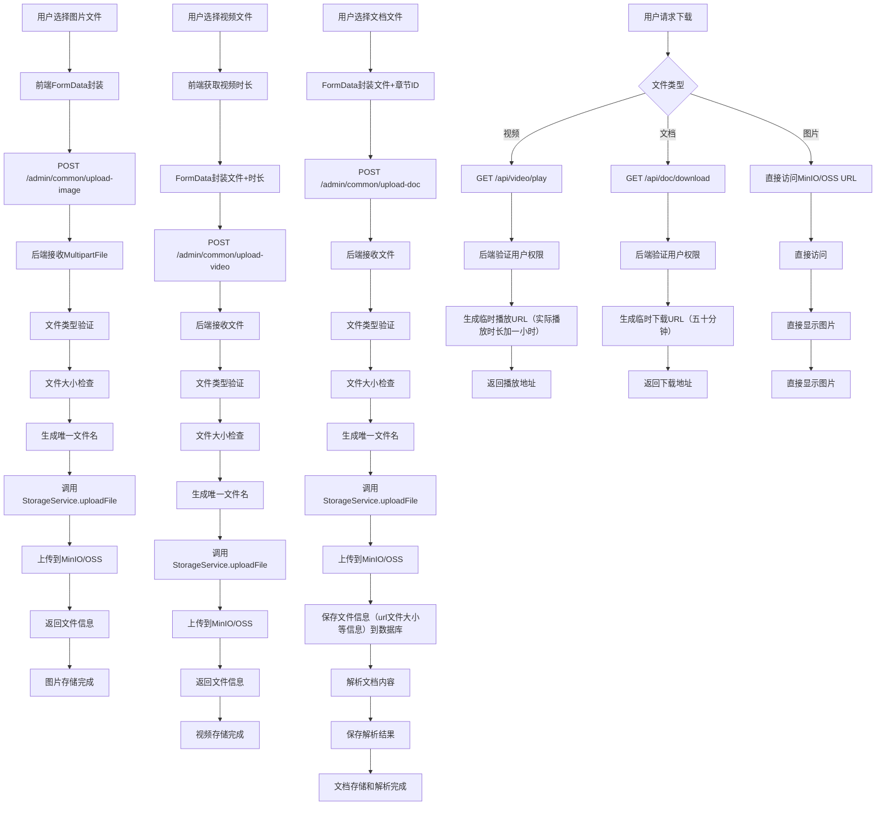

# 系统上传下载流程图

## 系统架构概述

本系统采用**后端转发上传**模式，所有文件上传都通过后端服务器中转处理，确保文件安全性和统一管理。

## 上传下载流程图



## 三种上传逻辑详解

### 1. 图片上传（后端转发）
**流程**：
- 前端调用 `POST /admin/common/upload-image`
- 后端接收 `MultipartFile` 文件对象
- 文件类型验证（JPG、PNG、GIF等）
- 文件大小检查（最大2MB）
- 生成唯一文件名：`images/{timestamp}_{filename}`
- 调用 `StorageService.uploadFile()` 上传到MinIO/OSS
- 返回文件信息：`{objectName, fileName, fileSize, imageUrl}`

**特点**：
- 完全通过后端中转上传
- 统一文件管理和安全控制
- 支持MinIO和阿里云OSS一键切换

### 2. 视频上传（后端转发 + 时长获取）
**流程**：
- 前端获取视频时长
- 调用 `POST /admin/common/upload-video`
- 后端接收文件并验证（MP4、AVI、MOV等格式）
- 文件大小检查（最大2GB）
- 生成唯一文件名：`videos/{timestamp}_{filename}`
- 调用 `StorageService.uploadFile()` 上传到MinIO/OSS
- 返回文件信息：`{objectName, fileName, fileSize, duration, videoUrl}`

**特点**：
- 自动获取并记录视频时长
- 支持大文件上传（2GB）
- 记录播放进度功能

### 3. 文档上传（后端转发 + 内容解析）
**流程**：
- 前端调用 `POST /admin/common/upload-doc`
- 后端接收文件并验证（PDF、DOC、DOCX、TXT等）
- 文件大小检查（最大100MB）
- 生成唯一文件名：`documents/{timestamp}_{filename}`
- 调用 `StorageService.uploadFile()` 上传到MinIO/OSS
- 保存文件信息到数据库
- 解析文档内容（PDFBox、POI等）
- 保存解析结果到 `doc_json` 字段

**特点**：
- 支持多格式文档解析
- 分页存储便于在线阅读
- 解析失败时提供原始文件下载

## 三种下载逻辑详解

### 1. 视频播放（临时播放URL）
**流程**：
- 前端调用 `GET /api/video/play?chapterId={id}`
- 后端验证用户权限（免费/付费章节）
- 生成临时播放URL（有效期：视频时长+1小时）
- 返回播放地址

**权限控制**：
- 免费章节：所有用户可访问
- 付费章节：只有购买课程的学生可访问
- 教师：可访问自己课程的所有内容

### 2. 文档下载（临时下载URL）
**流程**：
- 前端调用 `GET /api/doc/download?chapterId={id}`
- 后端验证用户权限
- 生成临时下载URL（有效期：5分钟）
- 返回下载地址

**权限控制**：
- 与视频播放相同的权限控制
- 支持原始文件下载

### 3. 图片访问（直接访问）
**流程**：
- 直接访问MinIO/OSS的URL
- 无需特殊权限验证
- 直接显示图片

## 技术架构要点

### 存储服务配置
```yaml
storage:
  type: minio  # 或 oss
  minio:
    endpoint: http://localhost:9000
    accessKey: your-minio-key
    secretKey: your-minio-secret
    bucketName: your-bucket
  oss:
    endpoint: oss-cn-beijing.aliyuncs.com
    accessKeyId: your-access-key
    accessKeySecret: your-secret-key
    bucketName: your-bucket
```

### 文件上传配置
```yaml
spring:
  servlet:
    multipart:
      max-file-size: 2GB          # 支持最大2GB文件
      max-request-size: 2GB        # 请求总大小限制
      file-size-threshold: 10MB    # 文件大小阈值
      location: /tmp/upload        # 临时文件存储路径
```

### 权限控制
- **基于用户类型**：STUDENT、TEACHER、ADMIN
- **基于购买状态**：免费/付费章节
- **实时验证**：每次访问都验证权限

### 缓存策略
- **播放URL缓存**：视频时长+1小时
- **下载URL缓存**：5分钟有效期

## 前端实现要点

### 上传组件
```javascript
// 图片上传
const uploadImage = async (file) => {
  const formData = new FormData()
  formData.append('file', file)
  const res = await request.post('/admin/common/upload-image', formData)
  return res.data
}

// 视频上传
const uploadVideo = async (file, duration) => {
  const formData = new FormData()
  formData.append('file', file)
  if (duration) {
    formData.append('duration', duration)
  }
  const res = await request.post('/admin/common/upload-video', formData)
  return res.data
}

// 文档上传
const uploadDoc = async (file, chapterId) => {
  const formData = new FormData()
  formData.append('file', file)
  formData.append('chapterId', chapterId)
  await request.post('/admin/common/upload-doc', formData)
}
```

### 下载组件
```javascript
// 视频播放
const getVideoUrl = async (chapterId) => {
  const res = await request.get('/api/video/play', { 
    params: { chapterId } 
  })
  return res.data
}

// 文档下载
const getDocUrl = async (chapterId) => {
  const res = await request.get('/api/doc/download', { 
    params: { chapterId } 
  })
  return res.data
}
```

## 后端实现要点

### StorageService接口
```java
public interface StorageService {
    void uploadFile(MultipartFile file, String objectName);
    String getDownloadUrl(String objectName);
    String getPresignedDownloadUrl(String objectName, long expireSeconds);
}
```

### 文件上传控制器
```java
@PostMapping("/upload-image")
public Result<Map<String, Object>> uploadImage(@RequestParam("file") MultipartFile file) {
    // 文件验证
    if (!isImageFile(file.getOriginalFilename())) {
        return Result.error("只支持上传图片文件");
    }
    
    // 生成文件名
    String objectName = "images/" + System.currentTimeMillis() + "_" + fileName;
    
    // 上传到存储服务
    storageService.uploadFile(file, objectName);
    
    // 返回文件信息
    Map<String, Object> result = new HashMap<>();
    result.put("objectName", objectName);
    result.put("imageUrl", storageService.getDownloadUrl(objectName));
    return Result.success(result);
}
```

## 安全考虑

### 权限验证
- 每次访问都验证用户权限
- 基于用户类型和购买状态
- 防止未授权访问

### 文件安全
- 文件类型验证（白名单）
- 文件大小限制
- 恶意文件检测
- 唯一文件名防止覆盖

### URL安全
- 临时URL自动过期
- 防止URL泄露
- 基于权限的访问控制

### 异常处理
```java
@ExceptionHandler
public Result exceptionHandler(MaxUploadSizeExceededException ex){
    return Result.error("文件大小超过限制，最大支持2GB");
}

@ExceptionHandler
public Result exceptionHandler(MultipartException ex){
    return Result.error("文件上传失败：" + ex.getMessage());
}
```

## 性能优化

### 服务器配置
- 文件上传大小：2GB
- 请求超时：5分钟
- 临时文件阈值：10MB
- 连接池优化：支持大文件上传

### 监控和日志
- 上传耗时统计
- 文件大小记录
- 错误日志完善

### 临时文件管理
- 配置临时目录：`/tmp/upload`
- 提供清理脚本：`cleanup-temp.sh`

---

**总结**

本系统采用**后端转发上传**模式，所有文件上传都通过后端服务器中转处理，确保文件安全性和统一管理。通过 `StorageService` 接口实现MinIO和阿里云OSS的无缝切换，支持大文件上传、文档解析、权限控制等功能，为在线教育系统提供了完整的文件处理解决方案。 