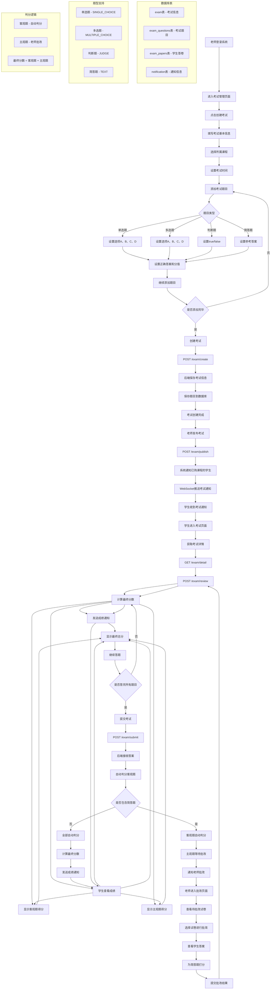

# 考试系统流程图

## 老师创建考试到学生考完的完整流程



## 流程详解

### 1. 老师创建考试阶段

**考试信息设置**：
- 考试名称
- 选择所属课程
- 设置开始和结束时间
- 添加考试题目

**题目类型支持**：
- **单选题**：A、B、C、D选项，自动判分
- **多选题**：A,B,C格式（逗号分隔），自动判分
- **判断题**：true/false，自动判分
- **简答题**：自由文本，需要老师批改

**接口**：`POST /exam/create`

### 2. 发布考试阶段

**发布条件**：
- 考试状态为"未开始"
- 学生已购买该课程且订单状态为"已支付"
- 学生尚未提交该考试

**通知机制**：
- 系统内通知消息
- WebSocket实时推送
- 自动跳转到考试列表页面

**接口**：`POST /exam/publish`

### 3. 学生参加考试阶段

**考试状态**：
- **未开始**：显示考试信息，无法进入
- **进行中**：可以参加考试
- **已结束**：显示考试信息，无法参加

**答题流程**：
- 逐题答题，自动保存答案
- 支持单选题、多选题、判断题、简答题
- 提交后无法修改答案
- 每人只能提交一次

**接口**：`GET /exam/detail`、`POST /exam/submit`

### 4. 自动判分流程

**客观题自动判分**：
- **单选题**：答案完全匹配
- **多选题**：答案顺序无关，内容匹配
- **判断题**：大小写不敏感

**主观题处理**：
- 简答题不参与自动判分
- 等待老师手动批改
- 通知老师有新试卷需要批改

**判分逻辑**：
```java
// 客观题自动判分
if ("SINGLE_CHOICE".equals(type) || "MULTIPLE_CHOICE".equals(type) || "JUDGE".equals(type)) {
    boolean isCorrect = checkAnswer(question, userAnswer);
    if (isCorrect) {
        autoScore += question.getScore();
    }
}
// TEXT题型不判分，留给老师批改
```

### 5. 老师批改流程

**批改条件**：
- 考试包含简答题（主观题）
- 学生已提交考试
- 客观题已自动判分完成

**批改步骤**：
1. 进入"批改试卷"页面
2. 选择要批改的考试
3. 查看学生答案和参考答案
4. 为每道简答题打分
5. 提交批改结果

**接口**：`POST /exam/review`

**分数计算**：
```java
// 计算主观题总分
int subjectiveScore = subjectiveScores.values().stream().mapToInt(Integer::intValue).sum();
// 合并总分
int finalScore = autoScore + subjectiveScore;
```

### 6. 成绩查看阶段

**成绩显示**：
- **客观题**：提交后立即显示得分
- **主观题**：需要等待老师批改
- **最终分数**：客观题得分 + 主观题得分

**通知机制**：
- 无主观题：提交后立即发送成绩通知
- 有主观题：批改完成后发送成绩通知

## 技术要点

### 数据库设计

**exam表**：考试基本信息
- examId：考试ID
- examName：考试名称
- courseId：所属课程
- startTime/endTime：考试时间
- teacherId：创建教师

**exam_questions表**：考试题目
- questionId：题目ID
- examId：所属考试
- questionType：题目类型
- questionContent：题目内容
- options：选项（单选题、多选题）
- correctAnswer：正确答案
- score：分值

**exam_papers表**：学生答卷
- paperId：答卷ID
- userId：学生ID
- examId：考试ID
- answer：学生答案（JSON格式）
- autoScore：客观题得分
- finalScore：最终分数
- isReviewed：是否已批改
- subjectiveScores：主观题得分（JSON格式）

### 权限控制

**老师权限**：
- 只能创建自己课程的考试
- 只能批改自己创建的考试
- 只能编辑未开始的考试

**学生权限**：
- 只能参加已购买课程的考试
- 只能提交一次考试
- 只能在考试时间范围内提交

### 通知机制

**考试发布通知**：
```java
// 发送考试通知
Notification notification = new Notification();
notification.setUserId(order.getUserId());
notification.setType("EXAM");
notification.setContent("您购买的课程《" + exam.getExamName() + "》有新考试，时间为:"+formattedTime+"请及时参加");
```

**批改完成通知**：
```java
// 发送批改完成通知
notification.setContent("您的考试《" + examName + "》已批改完成，最终得分：" + finalScore + "分");
```

### 错误处理

**提交限制**：
- 检查是否已提交过
- 检查考试时间是否有效
- 检查是否有权限参加考试

**批改限制**：
- 检查试卷是否存在
- 检查是否已批改过
- 检查是否有批改权限

这个考试系统通过自动判分和手动批改相结合的方式，既保证了客观题的公平性，又为主观题提供了人性化的批改机制。 