# 论坛系统流程图

## 论坛系统整体架构

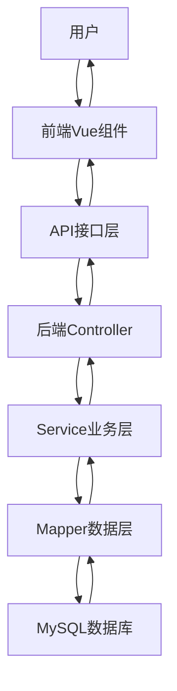

## 论坛核心功能流程

### 1. 帖子发布流程

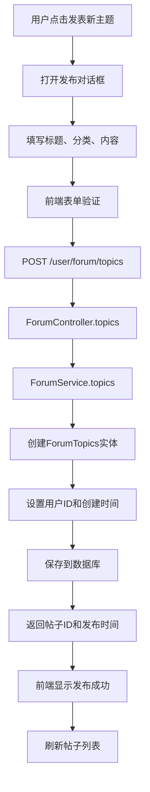

### 2. 帖子列表浏览流程

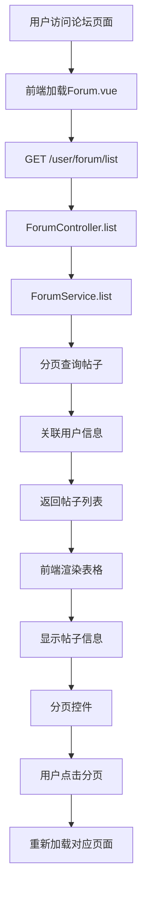

### 3. 帖子详情查看流程

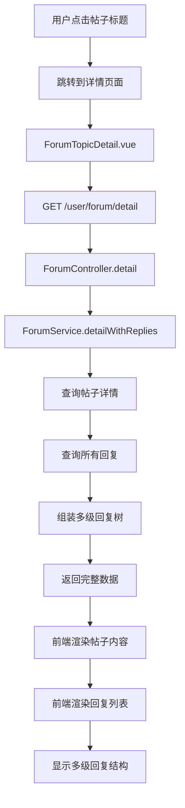

### 4. 回复发布流程

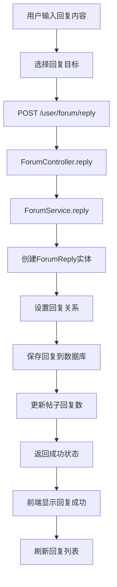

### 5. 帖子编辑流程

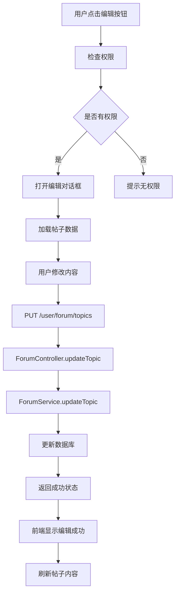

### 6. 帖子删除流程

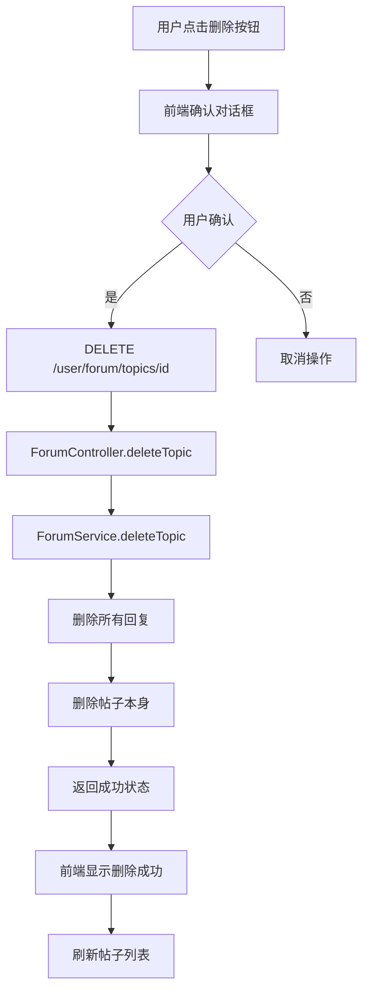

## 数据库设计

### 核心表结构

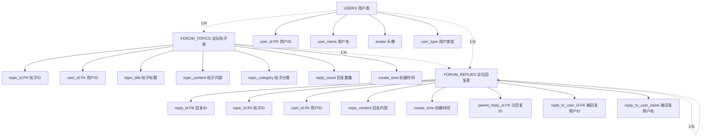

## 前端组件架构

### 组件层次结构

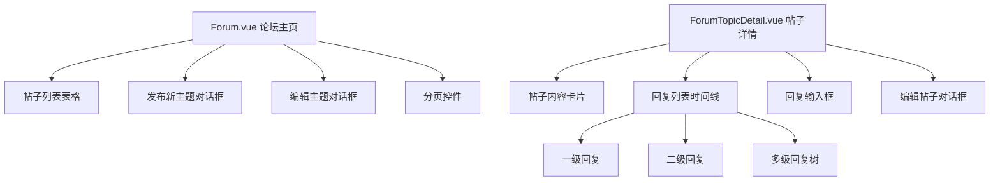

## 权限控制机制

### 权限验证流程

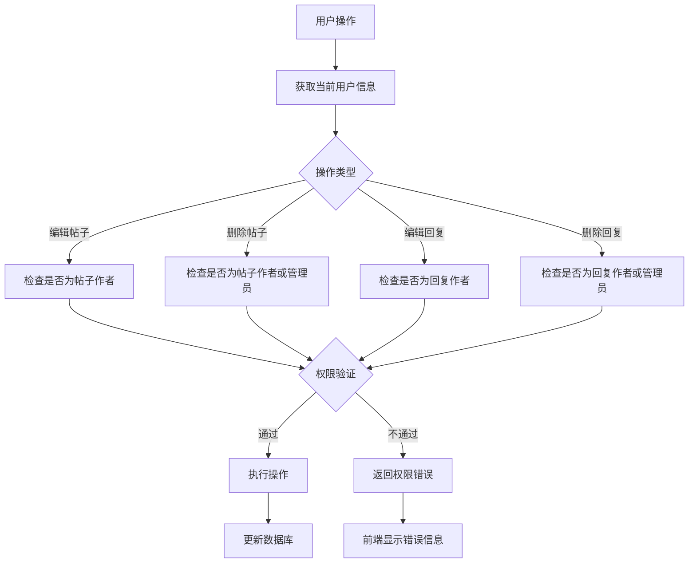

## 多级回复实现

### 回复树构建算法

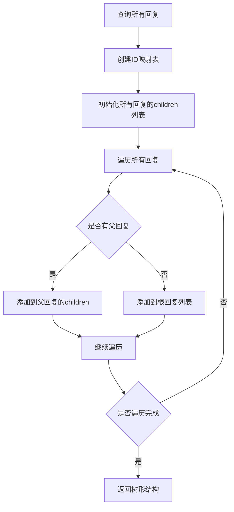

## 技术特点

### 1. 前端技术栈
- **Vue.js 2.x**：响应式数据绑定
- **Element UI**：UI组件库
- **Vuex**：状态管理
- **Vue Router**：路由管理

### 2. 后端技术栈
- **Spring Boot**：微服务框架
- **MyBatis Plus**：ORM框架
- **MySQL**：关系型数据库
- **JWT**：身份认证

### 3. 核心功能特性
- **分页查询**：支持大数据量分页
- **多级回复**：支持无限层级回复
- **权限控制**：基于用户角色的权限管理
- **实时更新**：操作后立即刷新数据
- **响应式设计**：支持移动端适配

### 4. 数据安全
- **SQL注入防护**：使用MyBatis参数化查询
- **XSS防护**：前端输入验证和转义
- **权限验证**：服务端权限检查
- **数据验证**：前后端双重验证

## API接口清单

### 帖子相关接口
- `GET /user/forum/list` - 分页查询帖子列表
- `POST /user/forum/topics` - 发布新帖子
- `PUT /user/forum/topics` - 编辑帖子
- `DELETE /user/forum/topics/{id}` - 删除帖子
- `GET /user/forum/detail` - 获取帖子详情

### 回复相关接口
- `POST /user/forum/reply` - 发布回复
- `PUT /user/forum/reply` - 编辑回复
- `DELETE /user/forum/reply/{id}` - 删除回复

### 批量操作接口
- `DELETE /user/forum/topics/batch` - 批量删除帖子
- `DELETE /user/forum/reply/batch` - 批量删除回复

这个论坛系统实现了完整的社区交流功能，包括帖子的发布、浏览、回复、编辑、删除等核心功能，支持多级回复和权限控制，具有良好的用户体验和系统安全性。 