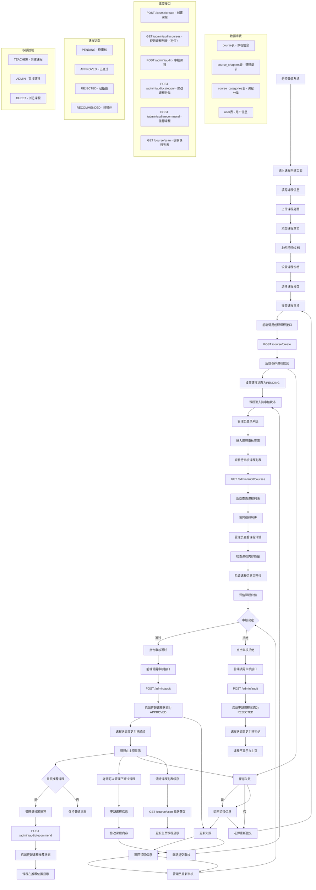

# 课程审核流程图

## 老师发表课程到管理员审核到主页显示的完整流程

## 流程说明

### 1. 老师创建课程阶段
- **权限**: 只有TEACHER角色可以创建课程
- **接口**: `POST /course/create`
- **状态**: 创建后状态为PENDING（待审核）
- **内容**: 课程信息、封面、章节、视频、价格、分类

### 2. 管理员审核阶段
- **权限**: 只有ADMIN角色可以审核课程
- **接口**: `GET /admin/audit/courses` - 获取课程列表（分页，支持按状态筛选）
- **接口**: `POST /admin/audit` - 审核课程
- **决定**: 通过/拒绝/修改分类

### 3. 课程状态管理
- **PENDING**: 待审核状态
- **APPROVED**: 审核通过，可在主页显示
- **REJECTED**: 审核拒绝，不在主页显示
- **RECOMMENDED**: 推荐状态，以评分排序

### 4. 主页显示机制
- **接口**: `GET /course/scan` - 获取课程列表
- **过滤**: 只显示状态为APPROVED的课程

### 5. 课程管理
- 已通过的课程老师可以继续管理
- 修改后需要重新提交审核
- 推荐课程有特殊显示位置

## 技术要点

### 权限控制
- 基于用户角色的权限验证
- 前端路由守卫 + 后端接口验证

### 状态管理
- 课程状态在数据库中维护
- 状态变更记录审核日志

