# 问答系统流程图

## 问答系统整体架构

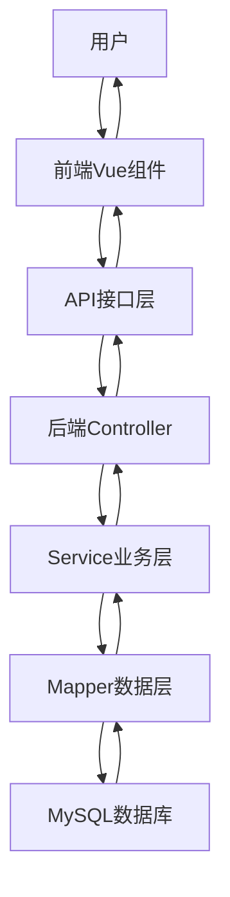

## 问答核心功能流程

### 1. 问题发布流程

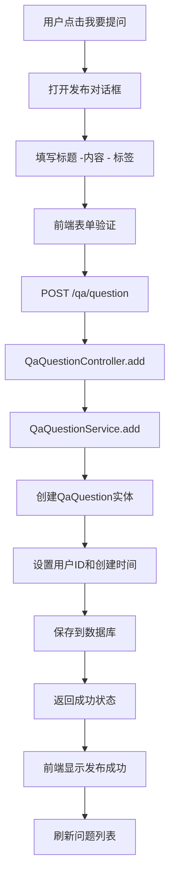

### 2. 问题列表浏览流程

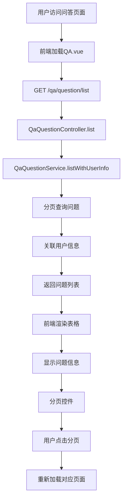

### 3. 问题详情查看流程

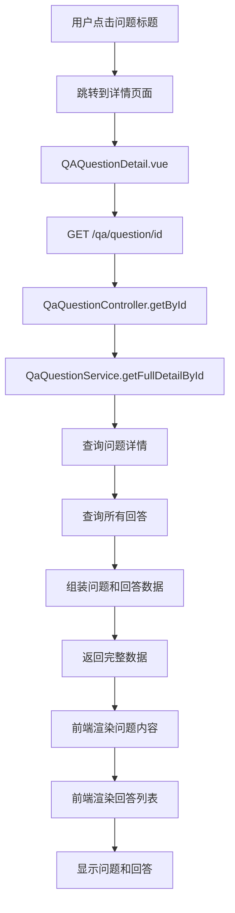

### 4. 回答发布流程

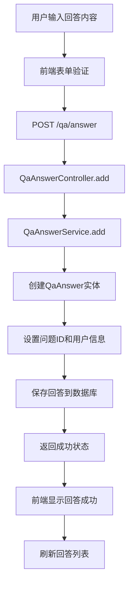

### 5. 问题编辑流程

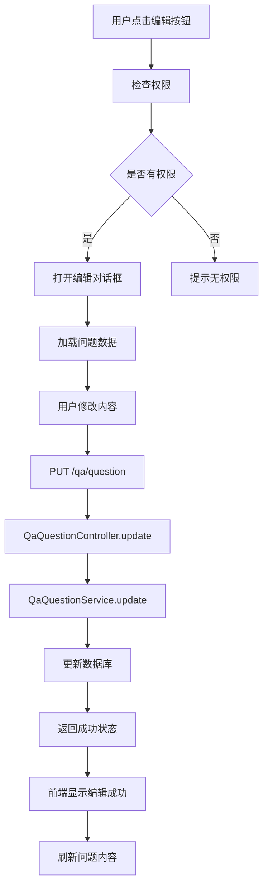

### 6. 回答编辑流程

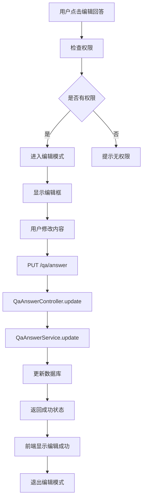

### 7. 设置最佳回答流程

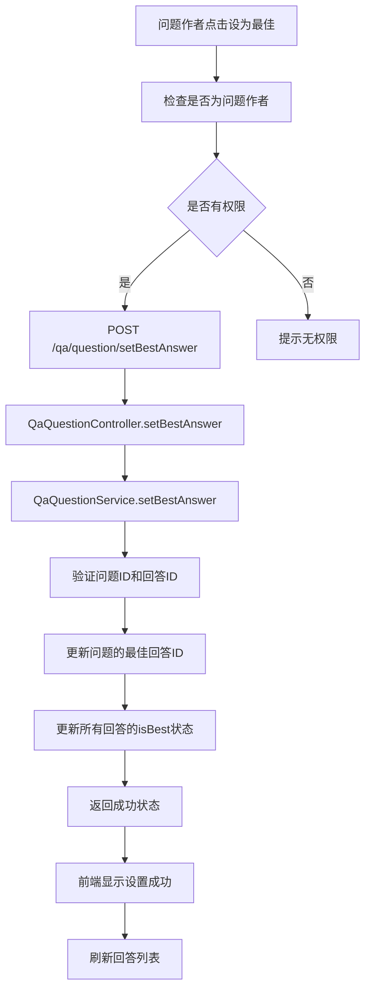

### 8. 问题删除流程

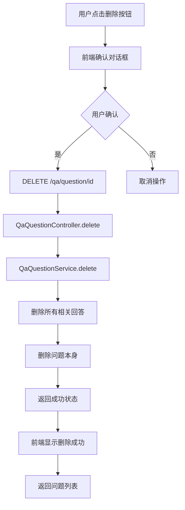

## 数据库设计

### 核心表结构

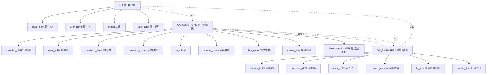

## 前端组件架构

### 组件层次结构

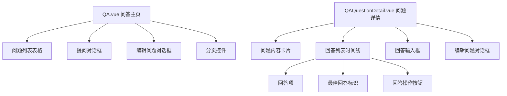

## 权限控制机制

### 权限验证流程

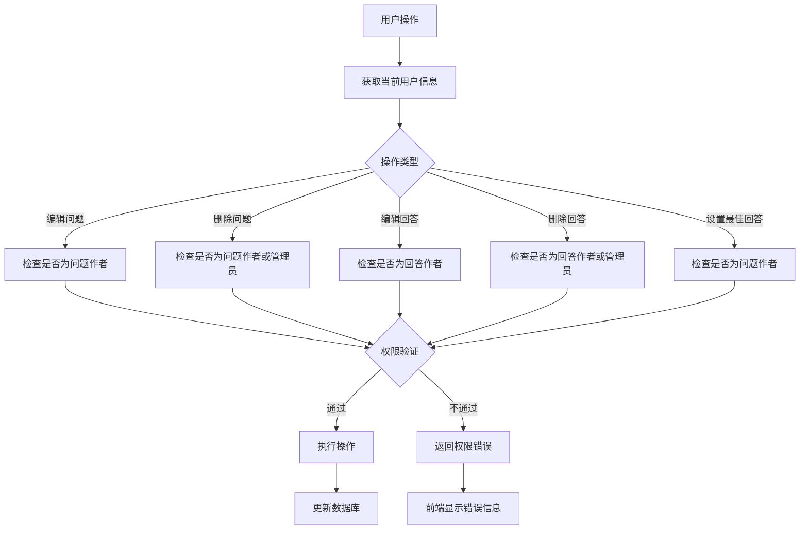

## 最佳回答机制

### 最佳回答设置算法

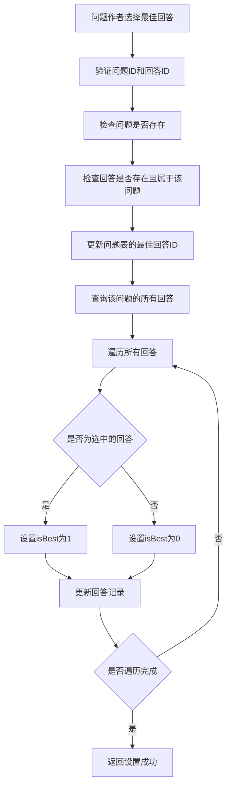

## 技术特点

### 1. 前端技术栈
- **Vue.js 2.x**：响应式数据绑定
- **Element UI**：UI组件库
- **Vuex**：状态管理
- **Vue Router**：路由管理

### 2. 后端技术栈
- **Spring Boot**：微服务框架
- **MyBatis Plus**：ORM框架
- **MySQL**：关系型数据库
- **JWT**：身份认证

### 3. 核心功能特性
- **问题管理**：发布、编辑、删除问题
- **回答管理**：发布、编辑、删除回答
- **最佳回答**：问题作者可设置最佳回答
- **权限控制**：基于用户角色的权限管理
- **分页查询**：支持大数据量分页
- **标签系统**：支持问题分类和搜索

### 4. 数据安全
- **SQL注入防护**：使用MyBatis参数化查询
- **XSS防护**：前端输入验证和转义
- **权限验证**：服务端权限检查
- **数据验证**：前后端双重验证

## API接口清单

### 问题相关接口
- `GET /qa/question/list` - 分页查询问题列表
- `POST /qa/question` - 发布新问题
- `PUT /qa/question` - 编辑问题
- `DELETE /qa/question/{id}` - 删除问题
- `GET /qa/question/{id}` - 获取问题详情
- `POST /qa/question/setBestAnswer` - 设置最佳回答

### 回答相关接口
- `POST /qa/answer` - 发布回答
- `PUT /qa/answer` - 编辑回答
- `DELETE /qa/answer/{id}` - 删除回答
- `GET /qa/answer/{id}` - 获取回答详情
- `GET /qa/answer/list` - 分页查询回答列表

这个问答系统实现了完整的社区问答功能，包括问题的发布、浏览、回答、编辑、删除等核心功能，支持最佳回答机制和权限控制，具有良好的用户体验和系统安全性。 